# GearMoney

App Flutter para control de gastos, ingresos y presupuestos personales usando SQLite local.


## Plataformas

- Android
- iOS
- Windows
- Linux
- macOS

## Stack y Arquitectura

- UI: Flutter (Material 3)
- DB local: `sqflite` en mobile y `sqflite_common_ffi` en desktop
- Tema: `ThemeMode` con `themeNotifier`
- Fuente principal: Verdana

Flujo principal de pantallas:

1. Login
2. MainLayout con navegación inferior:
	 - Dashboard
	 - Estadísticas
	 - Perfil
3. Menú de acción (botón +) para crear:
	 - Movimiento
	 - Categoría
	 - Presupuesto

## Base de Datos (SQLite)

La base vive en un archivo llamado `supersecure.db`, inicializada desde `DatabaseHelper`.

Notas importantes del modelo:

- Los montos se guardan en centavos (`INTEGER`), no en `double`.
- La fecha de movimientos se guarda como texto con formato `yyyy-MM-dd`.
- Los presupuestos se relacionan con categorías mediante tabla pivote.

### Tablas

#### Usuario

- `id` (PK autoincrement)
- `nombre`
- `apellidos`
- `correo`
- `contrasena`

Uso:

- Registro y login local.
- Validación de correo único en creación.

#### Categorias

- `id` (PK autoincrement)
- `nombre`
- `color` (hex string)
- `icono` (emoji/string)
- `usuario_id`

Uso:

- Clasificar movimientos.
- Personalización visual de chips/cards por categoría.

#### Movimientos

- `id` (PK autoincrement)
- `is_ingreso` (`1` ingreso, `0` gasto)
- `cantidad` (centavos)
- `nombre`
- `descripcion`
- `fecha` (`yyyy-MM-dd`)
- `tiene_hora`
- `hora` (`HH:mm`)
- `categoria_id`
- `usuario_id`
- `metodo_pago` (enum index)

Uso:

- Fuente principal para historial, dashboard y estadísticas.
- Se filtra por usuario y por tipo/categoría/fecha en listados.

#### Presupuestos

- `id` (PK autoincrement)
- `nombre`
- `monto` (centavos)
- `dia_ciclo`
- `usuario_id`

Uso:

- Define techo de gasto por conjunto de categorías.

#### Presupuestos_Categorias

- `id_presupuesto`
- `id_categoria`
- PK compuesta (`id_presupuesto`, `id_categoria`)

Uso:

- Relación N:N entre presupuestos y categorías.
- Permite calcular gasto agregado por presupuesto.

## Operaciones principales sobre DB

En `DatabaseHelper` existen CRUDs para:

- Usuario
- Categorías
- Movimientos

En presupuestos, la app usa queries directas sobre `Presupuestos` y `Presupuestos_Categorias` desde las pantallas de presupuesto/dashboard para:

- Crear presupuesto y asociar categorías
- Cargar presupuestos enriquecidos (categorías + gasto acumulado)
- Eliminar presupuesto y sus relaciones

## Componentes clave usados en screens

### MoneyInput

- Input de monto con validación y parser a centavos.
- Entrega valor normalizado con callback (`onChangedCents`).
- Se usa principalmente en creación/edición de movimientos.

### MoneyDisplay

- Renderiza montos formateados desde enteros (centavos).
- Puede mostrar ícono a la izquierda (SVG o imagen).
- Muy usado en dashboard y listas.

### CategoryChip

- Chip visual con color + ícono de categoría.
- Reutilizado en tarjetas/listados de movimientos.

### TransactionCardSmall

- Tarjeta compacta para resumen de movimientos en dashboard.
- Muestra categoría, nombre, fecha y monto (con color por tipo).

### BudgetCardSmall

- Tarjeta compacta para resumen de presupuestos.
- Muestra monto, restante/excedido y estado visual por severidad.

## Screens relevantes y cómo usan esos componentes

### Dashboard

- Calcula ingresos/gastos del periodo con `TransactionsCalculator`.
- Muestra saldo general con `MoneyDisplay`.
- Pinta últimos movimientos con `TransactionCardSmall`.
- Pinta presupuestos resumidos con `BudgetCardSmall`.

### Movimientos (Lista + Crear/Editar)

- `ListTransactionsScreen`:
	- Carga movimientos por usuario.
	- Filtros por tipo, categoría y rango de fecha.
	- Usa `CategoryChip` y `MoneyDisplay` en cada item.
	- Soporta swipe para eliminar y long press para editar.
- `CreateTransactionScreen`:
	- Usa `MoneyInput` para capturar monto.
	- Persiste en `Movimientos`.
	- Soporta modo edición (update).

### Categorías

- `CategoryListScreen`: listado y eliminación.
- `CreateCategoryScreen`: creación/edición con preview, selector de color e ícono.

### Presupuestos

- `CreatePresupuestoScreen`:
	- Crea presupuesto y filas en tabla pivote.
	- Bloquea categorías ya en uso por otros presupuestos.
- `PresupuestoListScreen`:
	- Enriquecimiento de cada presupuesto con gasto real.
	- Estado restante/excedido y acciones de edición/eliminación.

## Utilidades de dominio

- `MoneyFormatter`: convierte entre texto y centavos.
- `TransactionsCalculator`: agregaciones por rango/mes/categoría y métricas de presupuesto.

## Ejecutar el proyecto

```bash
flutter pub get
flutter run
```

---
# CleanScreenshots
## Login Screen


## Registro Screen


## Dashboard Screen
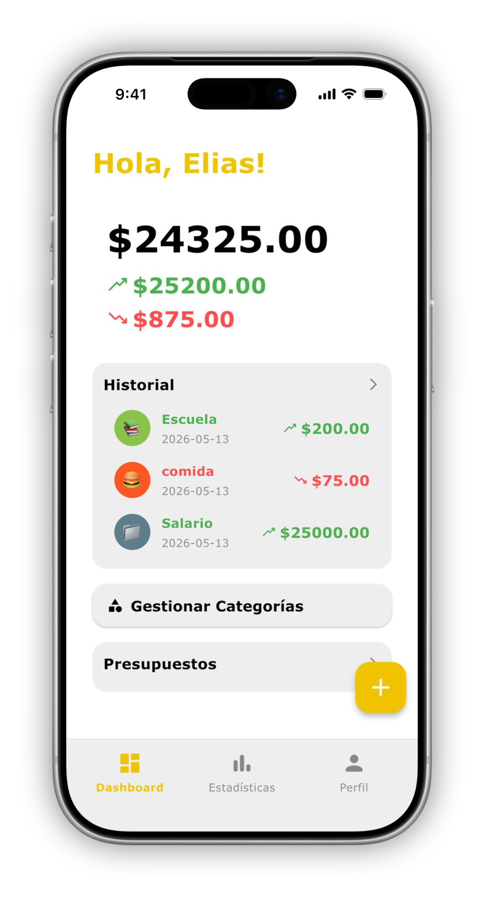
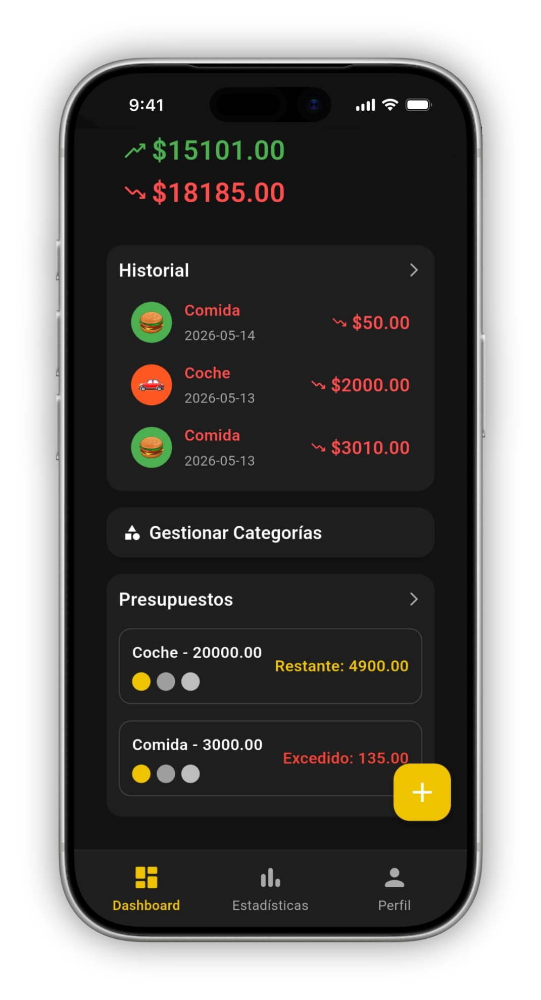
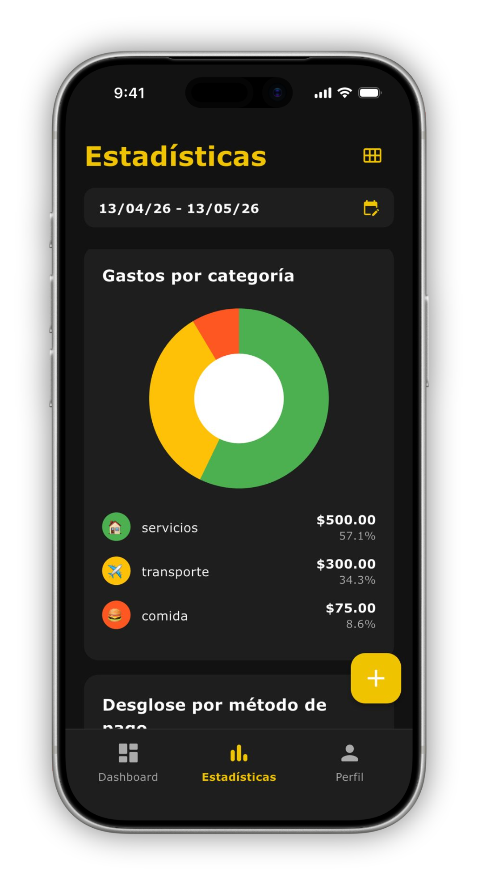
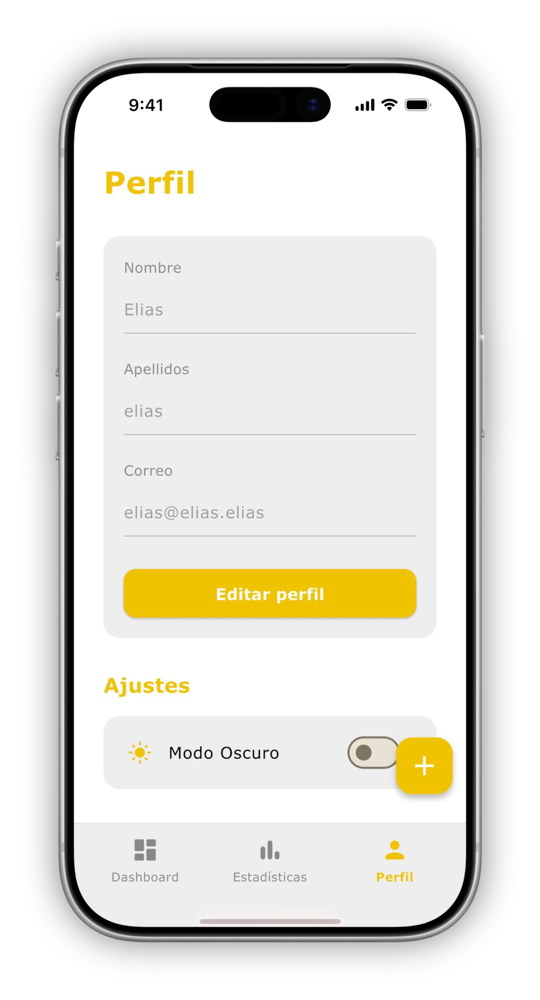

## Movimientos Screen
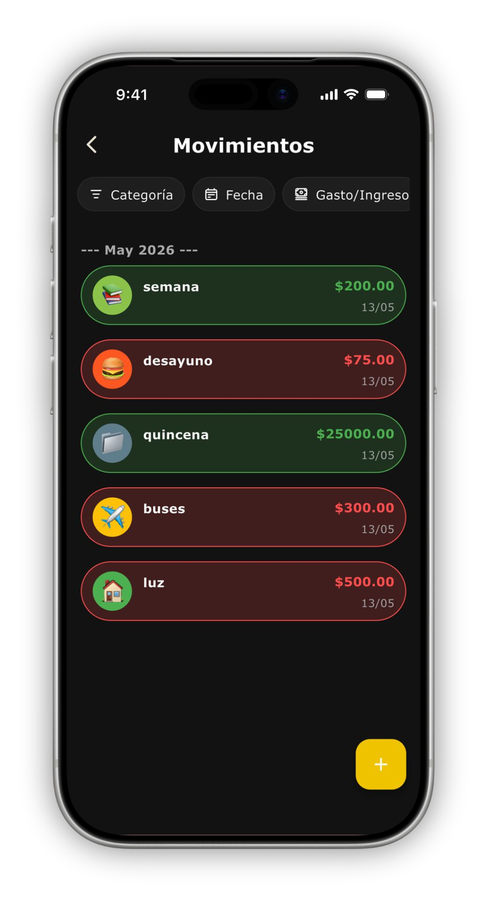
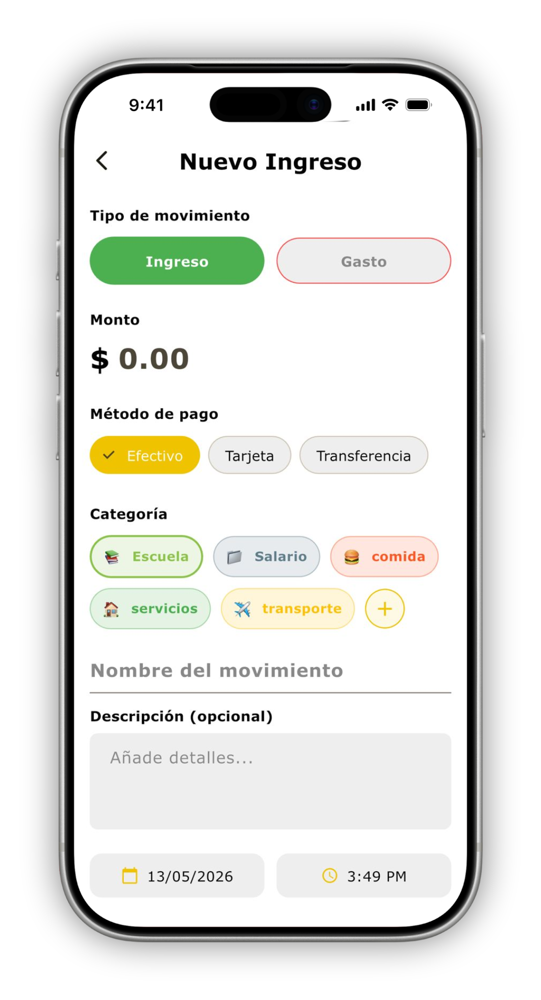

## Categorias Screen
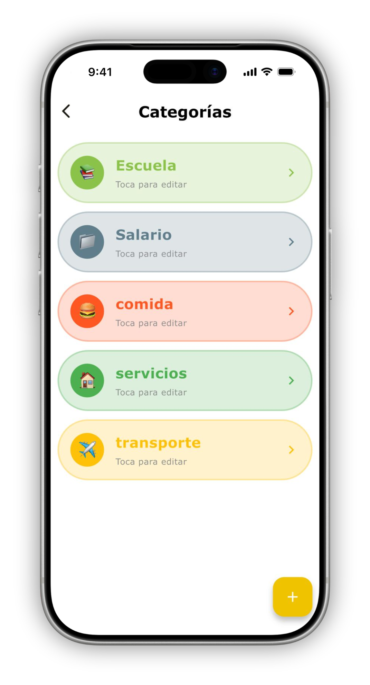
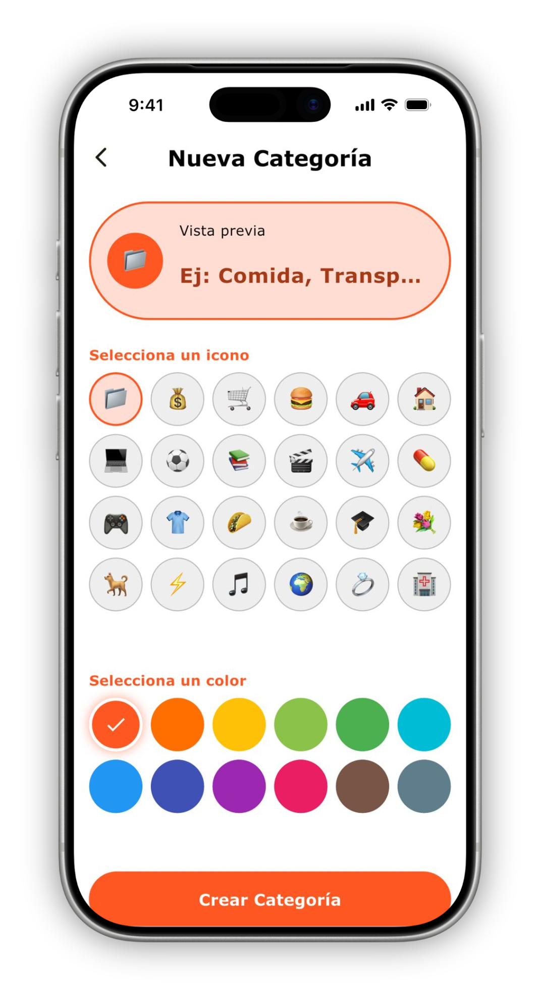

## Presupuestos Screen
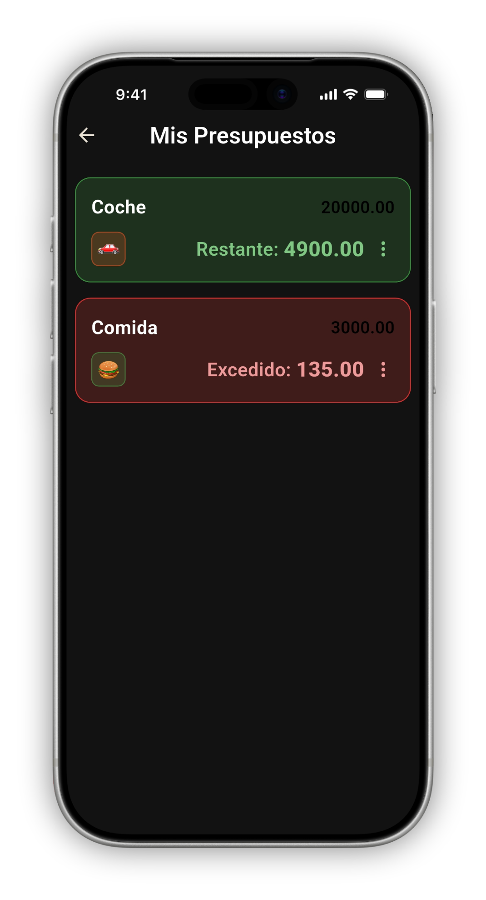
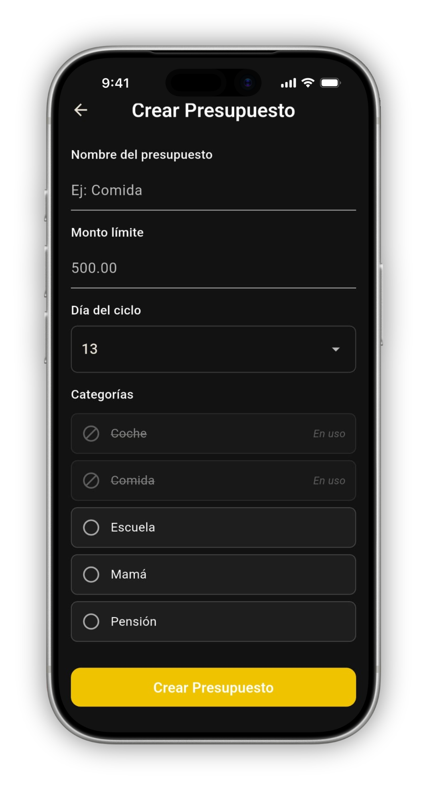

---
# Mockup seguido
## Login Screen

## Registro Screen
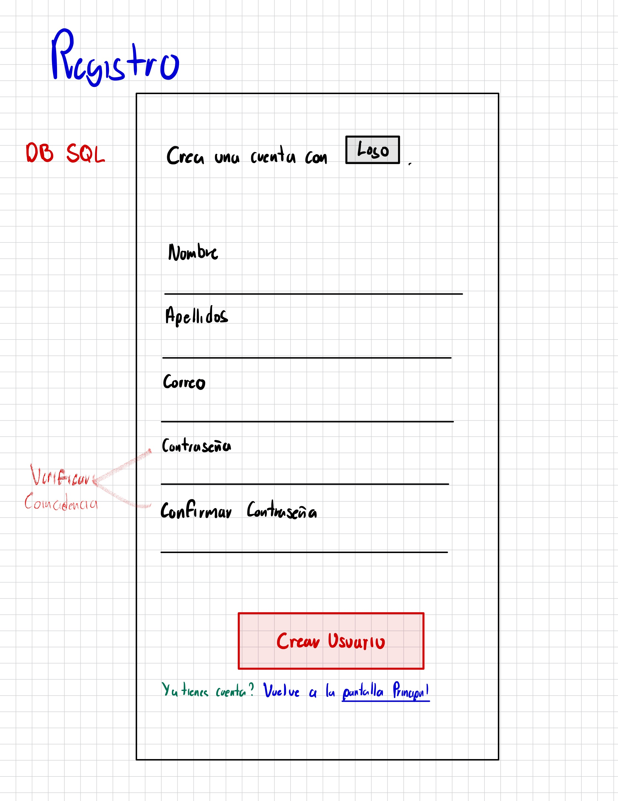
## Dashboard Screen
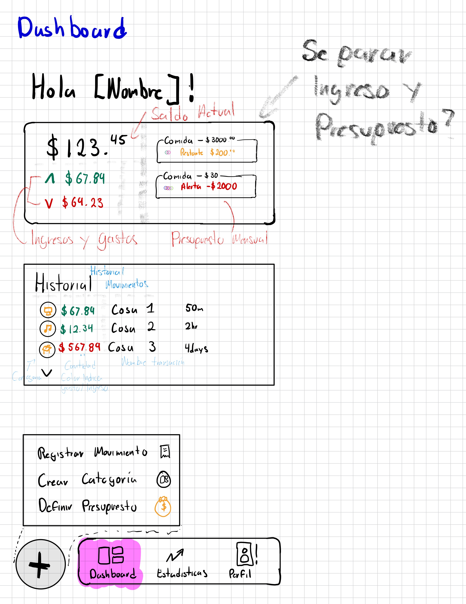


## Movimientos Screen


## Categorias Screen
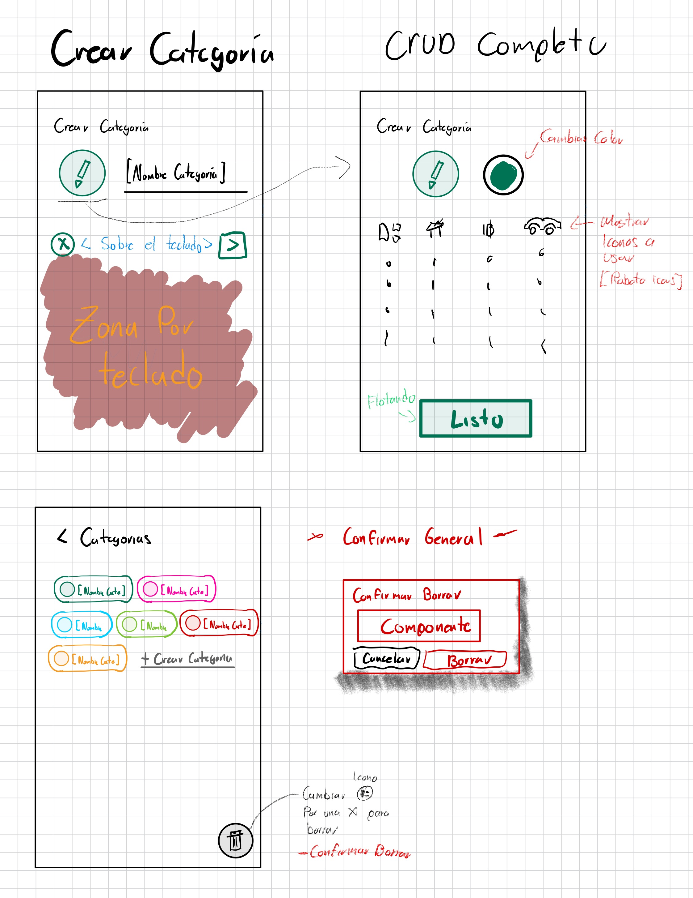
## Presupuestos Screen
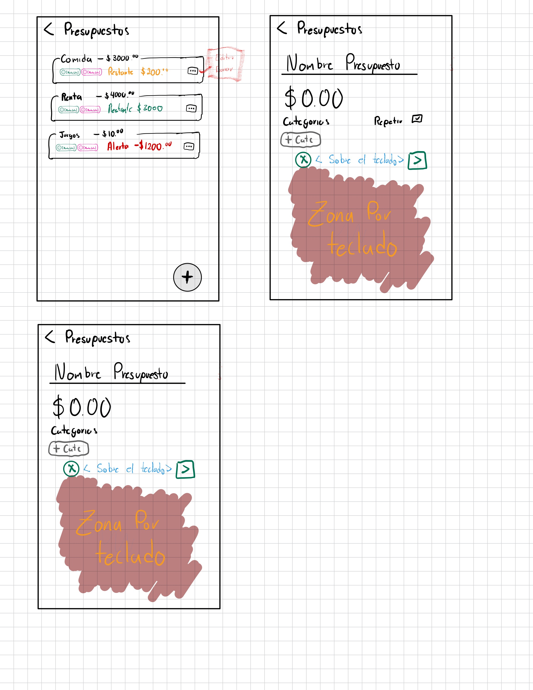
## DB Tablas
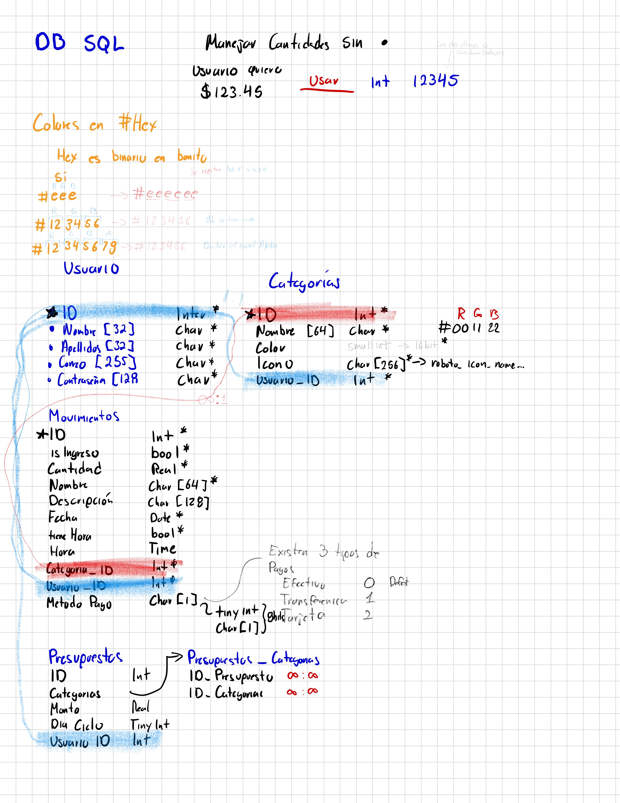
---